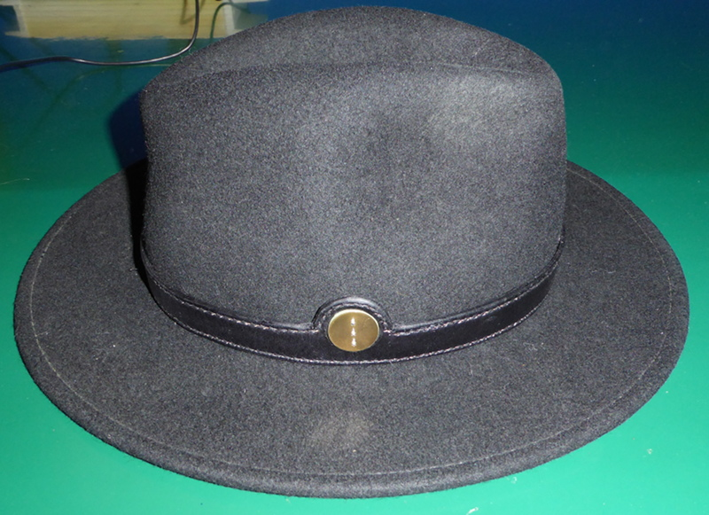
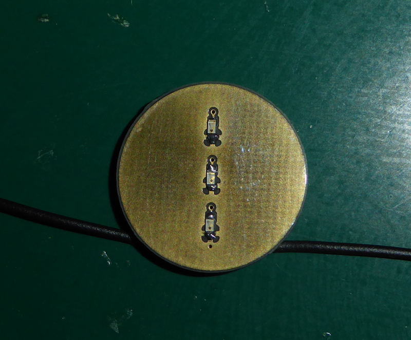
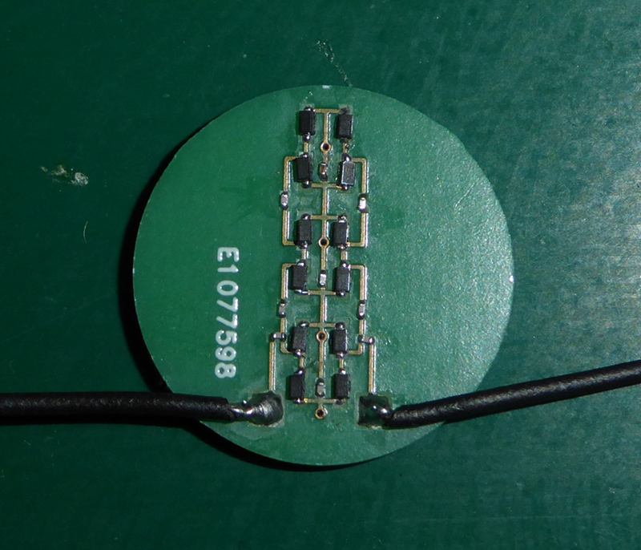

# RF-Concho
[A hat band for a nerd.](https://josepheoff.github.io/posts/1-hatband)

This project contains all the circuit diagrams and drawings needed to make a hat band with a passive cell phone detector.

The "range" is a  few centimeters at most - it isn't intended for any kind of serious measurement.

I made it because I could, and because the hat band on my fedora snapped.
